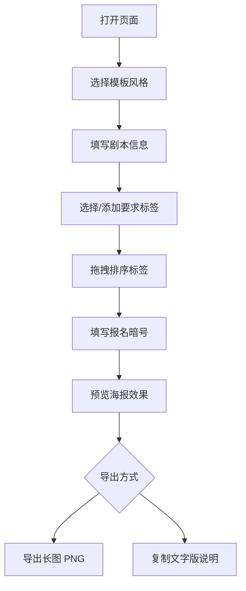

## 1. 产品概述
硬核推理车队招募海报生成器——面向剧本杀"车头"（组织者）的纯前端工具，用于快速生成视觉精美、信息清晰的硬核车队招募海报和文字版说明，方便在朋友圈、微信群、小红书等渠道发车时使用，减少低匹配玩家误上车。

- 目标用户：剧本杀硬核本车头/组织者
- 核心价值：把硬核车队的门槛说清楚、说得好看，一键生成社交分享素材
- 不承担报名管理，专注信息展示与视觉输出

## 2. 核心功能

### 2.1 用户角色
| 角色 | 注册方式 | 核心权限 |
|------|----------|----------|
| 车头（组织者） | 无需注册 | 使用全部功能 |

### 2.2 功能模块
1. **主页面**：模板选择 → 信息填写 → 标签排序 → 报名暗号 → 海报预览 → 导出

### 2.3 页面详情
| 页面名称 | 模块名称 | 功能描述 |
|----------|----------|----------|
| 主页面 | 模板选择区 | 提供三种风格模板缩略图：冷峻档案风、侦探通缉令风、复古车票风，点击选中高亮 |
| 主页面 | 信息填写区 | 表单输入：剧本名称、店铺位置、开车日期、预计时长、空缺人数、车费范围 |
| 主页面 | 标签生成与排序区 | 根据报名要求自动生成可读标签，支持拖拽排序、自定义添加/删除标签 |
| 主页面 | 报名暗号区 | 输入报名暗号或私聊格式，如"昵称+打过的三个硬核本+可到时间" |
| 主页面 | 海报预览区 | 实时预览所选模板风格的海报效果，适配手机长图比例 |
| 主页面 | 导出区 | 一键导出长图(PNG)和文字版招募说明，支持复制到剪贴板 |

## 3. 核心流程
用户打开页面 → 浏览并选择模板风格 → 填写剧本基本信息 → 选择/添加报名要求标签 → 拖拽排序标签（最重要的放上方） → 填写报名暗号 → 实时预览海报效果 → 导出长图或复制文字说明

## 4. 用户界面设计

### 4.1 设计风格
- **主色调**：深色系为主（暗青/深灰/暗红），搭配金色/橙色强调色，呼应硬核推理的紧张悬疑氛围
- **按钮风格**：圆角按钮，带微光效果和悬停动画
- **字体**：标题使用有力量感的字体（思源宋体/站酷仓耳渔阳体风格），正文使用清晰易读的无衬线字体
- **布局**：单页垂直流式布局，步骤式引导，移动端优先
- **图标风格**：线性图标，配合暗色调主题

### 4.2 页面设计概览
| 页面名称 | 模块名称 | UI元素 |
|----------|----------|--------|
| 主页面 | 模板选择区 | 三张模板缩略卡片，选中态有金色边框+光晕，暗色背景 |
| 主页面 | 信息填写区 | 暗色输入框，金色标签，微光分隔线，表单分组卡片 |
| 主页面 | 标签排序区 | 可拖拽标签列表，标签带图标和文字，拖拽时有阴影和位移动画 |
| 主页面 | 报名暗号区 | 突出显示的暗号输入框，带有"加密"视觉暗示 |
| 主页面 | 海报预览区 | 手机比例预览框，实时渲染，暗色外框包裹 |
| 主页面 | 导出区 | 两个并排按钮（导出图片/复制文字），带图标和动效 |

### 4.3 响应式设计
- 移动端优先设计，适配微信/小红书分享场景
- 桌面端双栏布局（左侧编辑，右侧预览）
- 触控优化：拖拽标签支持触摸操作

### 4.4 三种模板视觉风格
1. **冷峻档案风**：深灰/黑色背景，白色文字，类 FBI 档案排版，红色"CLASSIFIED"印章，打字机风格分隔线
2. **侦探通缉令风**：泛黄牛皮纸质感背景，黑色粗体文字，"WANTED"通缉令排版，指纹/墨迹装饰元素
3. **复古车票风**：米色/暖棕色底色，复古车票边框，锯齿撕边效果，老式印章式排版，车票打孔装饰
