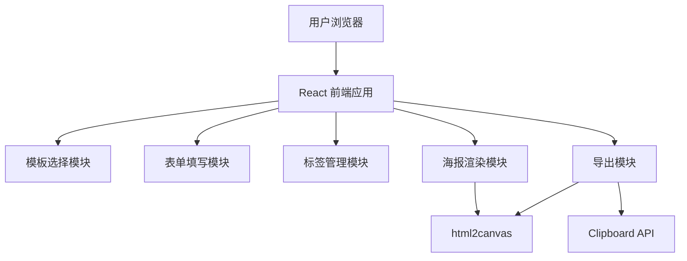
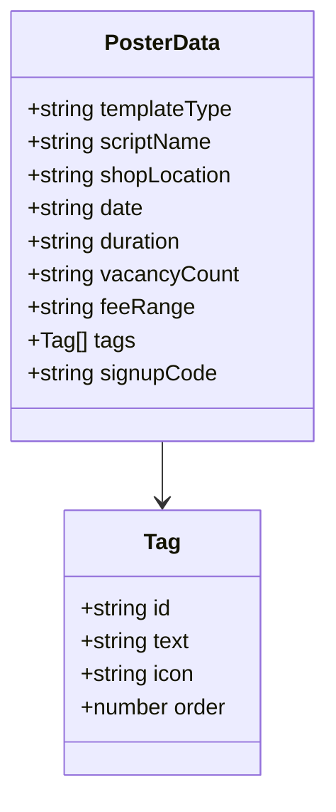

## 1. 架构设计
纯前端应用，无后端服务，所有数据存储在浏览器内存/state中。



## 2. 技术说明
- 前端：React@18 + TypeScript + Tailwind CSS + Vite
- 初始化工具：vite-init
- 后端：无
- 数据库：无（纯前端，状态管理使用 Zustand）
- 图片导出：html2canvas
- 拖拽排序：@dnd-kit/core + @dnd-kit/sortable
- 图标：lucide-react

## 3. 路由定义
| 路由 | 用途 |
|------|------|
| / | 主页面（单页应用，所有功能在一个页面内） |

## 4. API定义
无后端API

## 5. 服务器架构图
无后端服务

## 6. 数据模型

### 6.1 数据模型定义


### 6.2 核心状态结构
```typescript
interface PosterData {
  templateType: 'archive' | 'wanted' | 'ticket'
  scriptName: string
  shopLocation: string
  date: string
  duration: string
  vacancyCount: string
  feeRange: string
  tags: Tag[]
  signupCode: string
}

interface Tag {
  id: string
  text: string
  icon: string
  order: number
}
```

### 6.3 预置标签库
- 能做时间线
- 不怕长阅读
- 接受盘凶盘手法
- 禁迟到鸽子
- 需要笔记习惯
- 欢迎反串
- 需全程在线
- 不怕反转多
- 能接受机制复杂
- 希望有硬核经验
